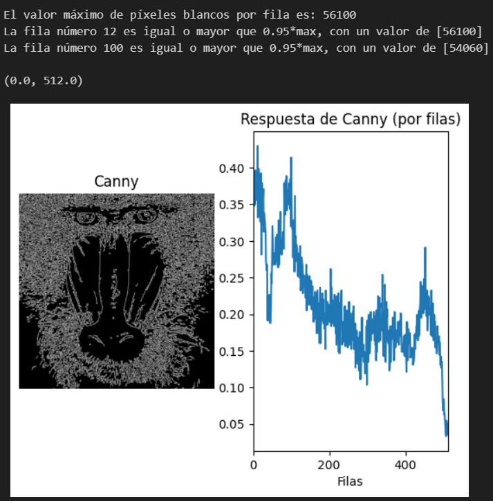
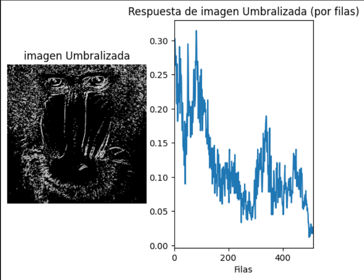
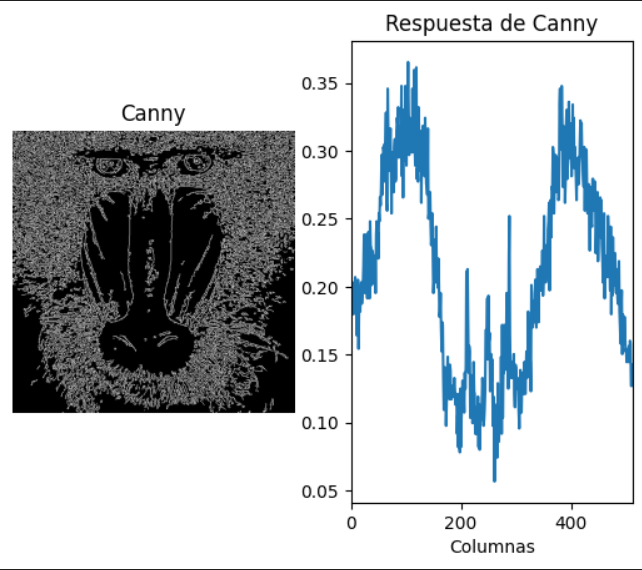
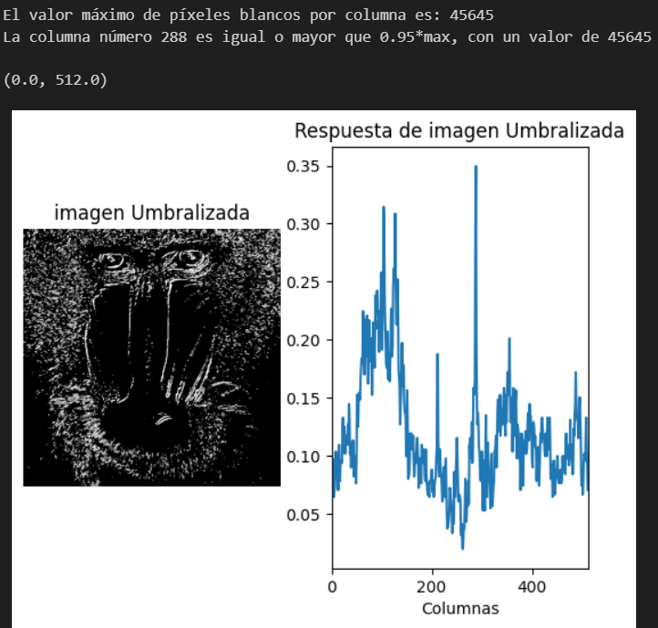

# Práctica 2. Funciones básicas de OpenCV.

### Realizado por:

                    - Andrés Felipe Vargas Cortés
                    - Miguel Ángel Peñate Alemán

## Realización de las Tareas.

## Realiza la cuenta de píxeles blancos por filas, determinando el valor máximo de píxeles blancos para filas, mostrando el número de filas y sus respectivas posiciones, con un número de píxeles blancos mayor o igual que 0.95*maxfil.

Para esta tarea simplemente se parte del código de ejemplo del propio cuaderno de prácticas donde se cuenta el número de pixeles blancos por columna y se ajusta para hacerlo por filas, para lo cual se modifican algunos de los parámetros como:

col_counts = cv2.reduce(canny, 0, cv2.REDUCE_SUM, dtype=cv2.CV_32SC1) 
row_counts = cv2.reduce(canny, 1, cv2.REDUCE_SUM, dtype=cv2.CV_32SC1)

Donde el segundo parámetro de la función cv2.reduce() nos permite sumar el número de pixeles por columna (0) o por fila (1).

cols = col_counts[0] / (255 * canny.shape[0])
rows = row_counts[:, 0] / (255 * canny.shape[1])

Este es otro ejemplo de cambios que se pueden apreciar, básicamente la variable cols guarda el número de pixeles blancos por columna, mientras que rows lo hace por fila, se debe a que en rows no guarda el contenido de las columnas pero sí el de las filas [:,0].

A continuación se realiza un simple calculo a partir de la fila con más pixeles bñancos de la imagen, donde se buscan aquellas otras filas que superen o tengan un número de pixeles blancos igual al 95% que el máximo encontrado.

Finalmente se imprimen todos los mensajes y se visualiza una gráfica así como la imagen utilizada.

## Aplica umbralizado a la imagen resultante de Sobel (convertida a 8 bits), y posteriormente realiza el conteo por filas y columnas. Calcula el valor máximo de la cuenta por filas y columnas, y determina las filas y columnas por encima del 0.95*máximo. Remarca con alguna primitiva gráfica dichas filas y columnas sobre la imagen. ¿Cómo se comparan los resultados obtenidos a partir de Sobel y Canny?

Esta tarea se resuelve apoyandose en la realización de la Tarea 1, así como en ejemplos que han aparecido en el propio cuaderno.

Primeramente la imagen pasa por una función Gaussiana con el objetivo de suavizar la imagen, luego de esto se procede a umbralizar la imagen de Sobel tanto en vertical como en horizontal, a partir de las cuales cmbinadas se crea la imagen de Sobel y es convertida a 8 bits. Una vez tenemos la imagen formada se umbraliza a partir de un umbral por defecto a 130.

//Gaussiana para suavizar la imagen original, eliminando altas frecuencias
ggris = cv2.GaussianBlur(gris, (3, 3), 0)

//Calcula en ambas direcciones (horizontal y vertical)
sobelx = cv2.Sobel(ggris, cv2.CV_64F, 1, 0)  # x
sobely = cv2.Sobel(ggris, cv2.CV_64F, 0, 1)  # y

//Combina ambos resultados
sobel = cv2.add(sobelx, sobely)

//Convertir Sobel a 8 bits
sobel_8bit = cv2.convertScaleAbs(sobel)

//Umbralizado de imagen Sobel
res, imagenUmbralizada = cv2.threshold(sobel_8bit, valorUmbral, 255, cv2.THRESH_BINARY)

A partir de aquí se recrea la tarea anterior donde por separado se recuentan columnas y filas, se calculan los máximos y se buscan aquellas filas y columnas iguales o superiores al 95% del máximo.

### Comparación entre Canny y Sobel

### Filas

En cuanto a las gráficas, muestran resultados que se asimilan, aunque la imagen Canny cuenta con más valores que la imagen sobel, es normal ya que se trata de una imagen umbralizada y es posible que cambiando el umbral tenga más pixeles blancos. 

### Columnas

En este caso, las gráficas se muestran un poco más diferentes, siguen algo similar pero no son tan similares, además se pueden apreciar picos en las dos imágenes que son diferentes, debido a los distintos efectos por los que han pasado las imágenes.

##  Proponer un demostrador que capture las imágenes de la cámara, y les permita exhibir lo aprendido en estas dos prácticas ante quienes no cursen la asignatura :). Es por ello que además de poder mostrar la imagen original de la webcam, incluya al menos dos usos diferentes de aplicar las funciones de OpenCV trabajadas hasta ahora.

### Reinterpretacion "My little piece of privacy"

Se trata de un demostrador muy inspirado en "My little piece of privacy" donde básicamente se captura el movimiento en video y función de donde se mueva el sujeto una cortina de pixeles translucidos le seguirá con el objetivo de ocultarle algo.

Realizado por: Andrés Felipe Vargas Cortés

### Party Time

Un demostrador sencillo pero divertido que funciona a través de la diferencia entre fotogramas es decir a partir del movimiento, a partir de un cierto umbral de movimiento se considerá que el sujeto que se mueve esta bailando y se aplican unos efectos que alteran los colores del video para simular una discoteca.

Realizado por: Miguel Ángel Peñate Alemán

