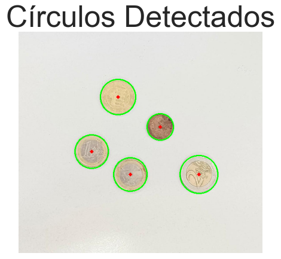
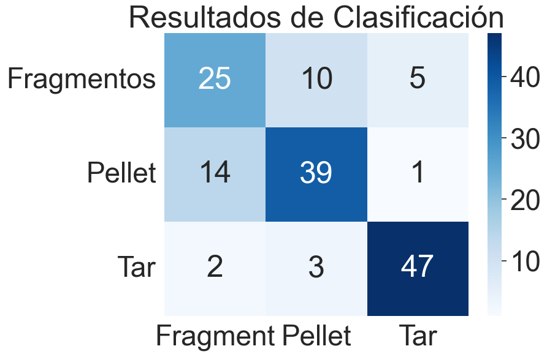

# Práctica 2. Funciones básicas de OpenCV.

### Realizado por:

                    - Andrés Felipe Vargas Cortés
                    - Miguel Ángel Peñate Alemán

## Realización de las Tareas.
## Determina la cantidad de dinero y monedas presentes en la imagen

Para el desarrollo de esta primera tarea se hizo uso de la función de Hough para la detección de círculos, a partir de la detección de los circulos se estima el diametro de cada uno a partir del centro del circulo y sus extremos, midiendo en pixeles. Con esta información se clasifican los círculos según el tamaño en diferentes categorías:

        0.01: 16.25, ->  1 céntimo
        0.02: 18.75, ->  2 céntimos
        0.05: 21.25, ->  5 céntimos
        0.1: 19.75,  ->  10 céntimos
        0.2: 22.25,  ->  20 céntimos
        0.5: 24.25,  ->  50 céntimos
        1: 23.25,    ->  1 euro
        2: 25.75     ->  2 euros

A continuación se escalan las medidas obtenidas, basandose en las medidas reales del diametro de las monedas. Cuando esto ha sido calculado se devuelve el valor de la moneda, aunque no siempre es exacto ya que la distancia a las monedas en la imagen puede variar.

Todo este procedimiento es activado al hacer click izquierdo sobre alguna moneda de 1€ que se encuentre en la imagen, a partir del diametro de esta se puede calcular el valor del resto de monedas, estos valores son sumados y se devuelve la cantidad de dinero de la imagen.

Como extra en esta actividad también se puede encontrar una célula de código que permite detectar estos objetos circulares en tiempo real y dibujar su contorno y centro.

Si en una imagen es complicado identificar la clase de moneda en video se vuelve un completo desafio, debido a las variaciones de iluminación, distancia variante, calidad de imagen, etc. Por lo que solo se limita a clasificar los objetos circulares en tres categorías según el tamaño.

## clasificación de las distintas partículas en imágenes

Para esta tarea hacemos uso de la compacidad para clasificar fragmentos, pellet y alquitrán 

#### Clasificador de Alquitrán:

A partir de la imagen en escala de grises y la lista de los contornos detectados se hace una búsqueda a partir de un cierto umbral, si el promedio del área del contorno detectato es inferior a este umbral y la compacidad calculada es es inferior o igual 0.8 se clasificará como alquitrán.

#### Clasificador de Fragmentos:

Los fragmentos se caracterizan por tener formas irregulares y colores no demasiado oscuros, por lo que al igual que el clasificador anterior se basa en los contornos detectados y un umbral, donde si el promedio del área del contorno lo superá y la compacidad es inferior al 0.6 será clasificado como un fragmento.

#### Clasificador de Pellet:

Una de las principales características que diferencian el Pellet de las otras partículas es su partícular forma circular, por ello se calcula la relación de aspecto del contorno y se comprueba si esta cumple con un umbral, si su compacidad es superior al 0.6 y el promedio del contorno es superior a cierto umbral será clasificado como Pellet.

Para terminar se muestran los resultados obtenidos en una matriz gráfica, donde se puede observar que la diagonal principal obtiene buenos datos, siendo el Alquitrán la particula que mejor encuentra y los fragmentos la que más se confunde.

