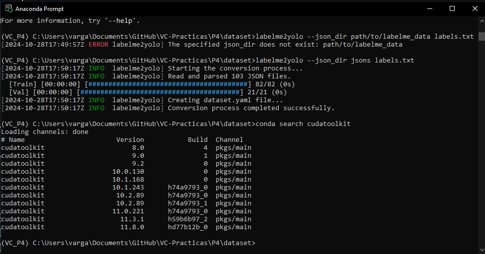

## Práctica 4. Reconocimiento de matrículas
### Contenidos

[Tarea](#41-aspectos-cubiertos)  
[YOLO](#42-yolo)  
[OCRs](#43-ocrs)  
[Detectando](#44-detectando-desde-muestro-codigo)  
[Entrenando YOLO](#45-entrenando-yolo)  
[Entrega](#46-entrega)

<!--[YOLOv7](#52-yolov7)  -->
## 4.6. Entrega

Para la entrega de esta práctica, la tarea consiste en desarrollar un prototipo que procese uno ([vídeo ejemplo proporcionado](https://alumnosulpgc-my.sharepoint.com/:v:/g/personal/mcastrillon_iusiani_ulpgc_es/EXRsnr4YuQ9CrhcekTPAD8YBMHgn16KwlunFg32iZM0xVQ?e=kzuw4l)) o varios vídeos (incluyendo vídeos de cosecha propia)):

- detecte y siga las personas y vehículos presentes
- detecte y lea las matrículas de los vehículos presentes
- cuente el total de cada clase
- vuelque a disco un vídeo que visualice los resultados
- genere un archivo csv con el resultado de la detección y seguimiento. Se sugiere un formato con al menos los siguientes campos:

```
fotograma, tipo_objeto, confianza, identificador_tracking, x1, y1, x2, y2, matrícula_en_su_caso, confianza, mx1,my1,mx2,my2, texto_matricula
```
## Instalación de CUDA
En esta tarea, hemos utilizado dos modelos de YOLO11n: el estándar y uno que hemos entrenado nosotros mismos. A continuación, se describe el proceso para entrenar nuestro modelo:

Dado que no es conveniente que el ordenador esté funcionando exclusivamente para este propósito durante varias horas, lo mejor es aprovechar la GPU para llevar a cabo el entrenamiento. Para ello, es necesario instalar CUDA y asegurarnos de que sea compatible con nuestro entorno de Anaconda.

Para verificar qué versiones son compatibles con nuestro entorno sin necesidad de realizar pasos adicionales, debemos ejecutar el siguiente comando en el Anaconda Prompt:

```
conda search cudatoolkit
```



Como podemos ver, la versión compatible más alta es la 11.8.0, una vez descargado e instalado, debemos realizar el siguiente comando en el anaconda prompt para instalar pytorch dentro del environment en el que queremos utilizar CUDA

```
conda install pytorch torchvision torchaudio pytorch-cuda=11.8 -c pytorch -c nvidia
```

Una vez instalado todo correctamente, podemos verificar que funciona mediante el siguiente comando de pytorch

```
import torch
print(torch.cuda.is_available())
```

##Entrenamiento modelo custom yolov8

Primero, utilizamos Labelme para generar un conjunto de datos compuesto por imágenes y etiquetas, con el objetivo de entrenar nuestro modelo para el reconocimiento de matrículas. Posteriormente, utilizamos Labelme2YOLO para convertir los datos al formato requerido para entrenar nuestro modelo. Luego, dividimos el conjunto de datos en tres grupos: entrenamiento (train), prueba (test) y validación (val).


La **entrega del cuaderno o cuadernos** se hace efectiva a través del campus virtual por medio de un **enlace github**. Además del **archivo README**, debe incluirse el resultado del vídeo proporcionado como test (o enlace al mismo), y el correspondiente archivo *csv*. En el caso de entrenarse algún detector, por ejemplo de matrículas, debe proporcionarse acceso al conjunto de datos.

Luego procedemos al entrenamiento del modelo

```
model = YOLO("yolo11n.yaml")
# Train the model with adjusted settings
results = model.train(data='C:/Users/varga/Documents/GitHub/VC-Practicas/P4/YOLODataset/dataset.yaml', 
                        epochs=300, 
                        imgsz=512, 
                        plots=True,
                        patience= 15,
                        batch=-1,
                        workers=12,
                        device=0,
                        )  
```
Una vez completado el entrenamiento, los pesos se almacenan en la carpeta trainX/weights/best.pt, junto con otros datos relacionados con el proceso de entrenamiento.

##Resultados

1. Vídeo Generado: El prototipo procesa el vídeo y genera un nuevo archivo que visualiza los resultados de la detección y seguimiento. (output_video.mp4)
2. Archivo CSV: Se genera un archivo CSV que contiene los resultados del procesamiento. 
***
Bajo licencia de Creative Commons Reconocimiento - No Comercial 4.0 Internacional
