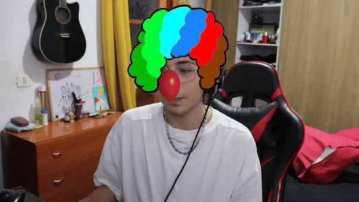

# Práctica 5. Detección y caracterización de caras

Realizado por:
- Andrés Felipe Vargas Cortés
- Miguel Ángel Peñate Alemán

## Trabajo realizado

En este trabajo hemos realizado tres filtros, a la hora de ejecutar el programa puedes cambiar entre los diferentes filtros usando las teclas "a" y "d"

## Filtro 1: Filtro de payaso

Este filtro añade una peluca de payaso y una nariz de payaso a la cara del usuario. La peluca se alinea automáticamente con los puntos de referencia del rostro, los bordes de los ojos y la barbilla, mientras que la nariz se coloca en la punta de la nariz del usuario.

## Filtro 2: Filtro invertido

Este filtro toma una sección circular de la cara, la invierte horizontalmente y la vuelve a colocar en el mismo lugar.
El filtro detecta los puntos de referencia de los ojos y la boca del usuario, calculando una zona circular alrededor de estos puntos.
Esta región de la cara se recorta y se invierte horizontalmente.
La imagen invertida se coloca de nuevo en la misma posición, creando el efecto de reflejo.

## Filtro 3: Filtro goku (Super Saiyan)

Nuestro tercer filtro está inspirado en la serie de manga/anime Dragon ball, en el cual simulamos la famosa transformación de Goku en super saiyan.
El filtro detecta si el usuario abre la boca haciendo uso de los puntos faciales, en caso de que esto sucede se activa la transformación a super saiyayin. Para volver al estado base basta con volver a abrir la boca y revertir la transformación.

