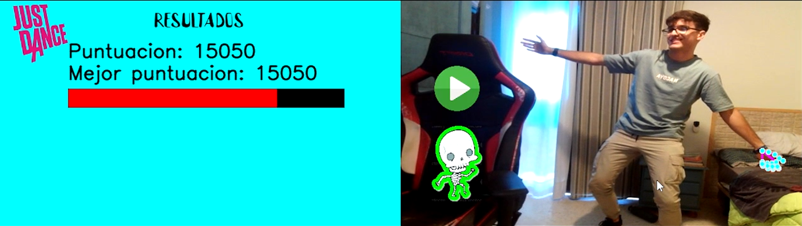

# Trabajo Final Contenido Visual

### Realizado por:
                    - Andrés Felipe Vargas Cortés
                    - Miguel Ángel Peñate Alemán

A continuación se muestran algunos ejemplos visuales de forma demostrativa de la ejecución del Trabajo, estas demostraciones se realizarán mediante imágenes y gifs.

### Baile con captura de esqueleto

- Imagen

- Gif

### Baile sin captura de esqueleto

- Imagen

- Gif

### Puntuación Final 

- Imagen

- Gif

